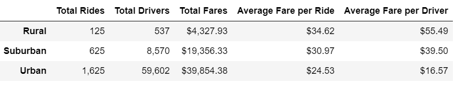
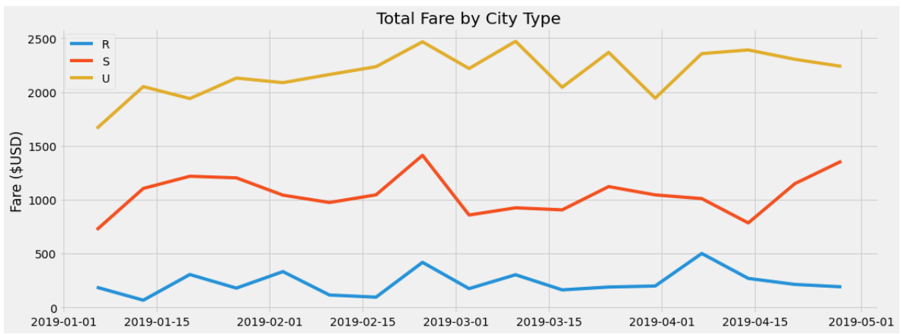

# PyBer_Analysis

## Overview of the analysis
In this project, I used Jupyter Notebook and Pandas to inspect data, merge data sets, perform calculations and create new dataframes. The project has two main deliverables. The first is a ride-sharing summary dataframe by city type. The second deliverable is a multiple-line chart of total fares for each city type. The purpose of this project is to present a summary of complex findings, and to visualize the data provided, to help PyBer make difficult business decisions.

## Results
The results of the analysis are as follows.

### Differences Based on City Type
As you can see in the chart below, the total number of rides - as well as and drivers - are in urban areas, followed by suburban and rural areas. The average fare, however, is highest in rural areas, followed by suburban and urban areas. Overall, total fares are highest in urban areas, followed by suburban and rural areas.

In the line graph below, you can see differences over time in fares among urban (yellow), suburban (red) and rural (blue) areas. Urban areas have consistently higher total fares, followed by suburban and rural areas. This is relatively consistent over time.

## Summary

Based on the results, here are three business recommendations for addressing any disparities among the city types. The first recommendation is to continue promoting urban ride-sharing. This is the bread and butter of the organization, in terms of total fares. The second recommendation is to increase promotion of drivers in rural areas. These areas tend to provide the highest average fair to drivers, but has the least number of drivers available. There is an opportunity in these areas. The third recommendation is based on the fact that ride-sharing is higher in the spring than in the winter - focus on warmer weather times - and reduce efforts in the winter times.
